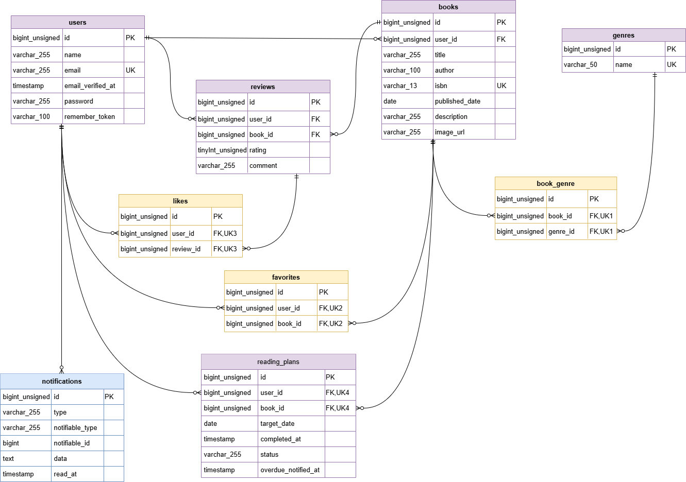

# Bookshelf 書籍レビューアプリ

書籍レビュー・読書記録の機能を実装したLaravelプロジェクトです。
ログイン不要で書籍一覧、書籍詳細（レビュー含む）、ランキングの閲覧が可能で、ログインユーザーは書籍やレビューの登録、コミュニティ機能（お気に入り・いいね）及び読書管理機能が使用できます。

## デモ

### 書籍一覧画面


### マイレポート画面


## 作成者

en6113

## 使用技術

### 🛠️ バックエンド
- PHP 8.2.x
- Laravel 10.x
  - Laravel Fortify (認証機能)
  - Laravel Sanctum (APIトークン認証)
  - Notification (通知機能)

### 💻 フロントエンド
- Blade(テンプレートエンジン)
- Tailwind CSS 3.4
- Vite（ビルドツール）

### 🗄️ データベース
- MySQL 8.0

### 🔌 外部API連携
- GoogleBooksAPI(ISBN検索)

### 🐳 インフラ / 開発環境
- Docker / Docker Compose
- Nginx (Webサーバー)
- phpMyAdmin (データベース管理ツール)

## ER図



## 動作環境

- Docker
- Docker Compose

※ Windowsの場合はWSL2の利用を推奨します。

## 環境構築手順

1. **リポジトリのクローン**

    ```bash
    git clone https://github.com/en6113/bookshelf-app.git
    ```

2. **.envファイルの準備**

    `.env.example` をコピーして `.env` を作成します。

    ```bash
    cp .env.example .env
    ```

    `.env` ファイル内の以下のDB接続情報が以下と一致していることを確認してください。

    ```ini
    DB_CONNECTION=mysql
    DB_HOST=mysql
    DB_PORT=3306
    DB_DATABASE=laravel
    DB_USERNAME=sail
    DB_PASSWORD=password
    ```

3. **Composer依存パッケージのインストール**

    プロジェクトの初回セットアップ時は、`vendor` ディレクトリが存在しないため `sail` コマンドを使用できません。
    以下のDockerコマンドを実行して、コンテナ内で `composer install` を実行します。

    ```bash
    docker run --rm \
    -u "$(id -u):$(id -g)" \
    -v "$(pwd):/var/www/html" \
    -w /var/www/html \
    -e COMPOSER_CACHE_DIR=/tmp/composer_cache \
    laravelsail/php82-composer:latest \
    composer install
    ```

4. **Laravel Sailの起動**

    以下のコマンドでDockerコンテナを起動します。

    ```bash
    ./vendor/bin/sail up -d
    ```

5. **エイリアスの設定**

    ```bash
    alias sail='[ -f sail ] && bash sail || bash vendor/bin/sail'
    ```

6. **アプリケーションキーの生成**

    ```bash
    sail artisan key:generate
    ```

7. **データベースのマイグレーションと初期データ投入**

    以下のコマンドでテーブルを作成し、ダミーデータを投入します。

    ```bash
    sail artisan migrate:fresh --seed
    ```
    このコマンドの入力後、コンテナ内にデータが残っており、エラーが生じているケースなどがあります。
    その場合は、以下のコマンドを順に実行して各コンテナを再起動して下さい。
    コマンド実行後にSQLコンテナが立ち上がるまで時間がかかります。30秒ほどお待ちください。
    ```bash
    sail down -v
    sail up -d
    sail artisan migrate:fresh --seed
    ```

8. **フロントエンドの準備**

    ```bash
    sail npm install
    sail npm run dev
    ```

    `npm run dev` は開発中は起動したままにしてください。

9. **アプリケーションへのアクセス**

    ブラウザで [http://localhost](http://localhost) にアクセスします。

## 開発環境URL

http://localhost

## 機能一覧

### 👤 一般ユーザー向け機能
#### 書籍閲覧・検索機能（ログイン不要）
- 書籍一覧表示（キーワード検索・ジャンル検索・並び順変更）
- 書籍詳細表示（レビュー付）
- ランキング表示（レビュー高評価順）
#### アカウント機能
- ユーザー登録 / ログイン / ログアウト(Laravel Fortify)
#### 書籍登録機能
- 書籍登録（手動登録、GoogleBooksAPI経由の自動取得）/ 編集 / 削除
#### ジャンル管理機能
- ジャンル一覧表示 / 新規追加 / 更新 / 削除
#### 読書管理機能
- 書籍への「お気に入り」機能（登録・解除）/ お気に入り一覧表示
- マイレポート表示（レビュー数、読了冊数、平均評価、評価分布、高評価書籍、ジャンル別評価傾向）
- 読書計画一覧表示 / 作成 / 編集 / 削除 / 通知
#### コミュニティ機能
- レビューの投稿 / 編集 / 削除
- レビューへの「いいね」機能（登録・解除）

### 🔌 外部公開用API（外部アプリケーション向け）
#### 書籍データ連携API
- 書籍一覧取得(GET) / 書籍詳細取得(GET)
- 書籍登録(POST) / 書籍更新(PUT) / 書籍削除(DELETE)(書き込み系はSanctum認証必須)

## APIエンドポイント一覧

※認証系エンドポイントはバージョン非依存のため、意図的に`/v1`の外に配置しています。

| HTTPメソッド | URI | 概要 | 認証 |
|---|---|---|
| GET | /api/v1/books | 書籍一覧（検索・ページネーション付き） | 不要 |
| GET | /api/v1/books/{book} | 書籍詳細（ジャンル含む） | 不要 |
| POST | /api/login | Sanctum APIトークン認証発行 | 不要 |
| POST | /api/v1/books | 書籍新規登録 | Sanctum |
| PUT | /api/v1/books/{book} | 書籍更新 | Sanctum |
| DELETE | /api/v1/books/{book} | 書籍削除 | Sanctum |